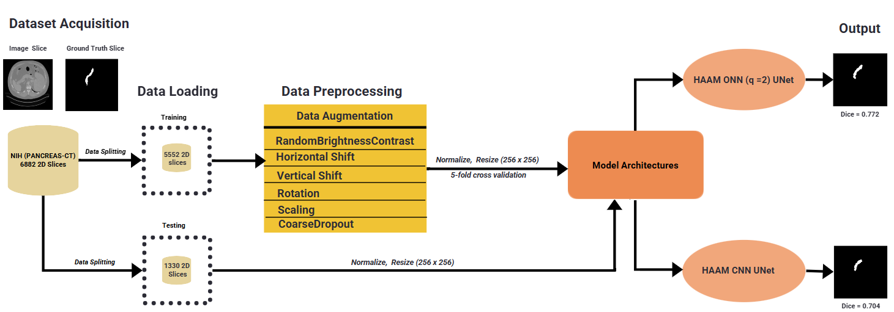

# Pancreas CT Segmentation Using Attention U-Net with Hybrid Adaptive Attention

<p align="center">
  
  
  
  
</p>

## Overview

This project investigates deep learning methods for **automatic pancreas segmentation in abdominal CT images**.

The main objective is to compare two versions of an **Attention U-Net enhanced with a Hybrid Adaptive Attention Module (HAAM)**:

1. **HAAM-CNN Attention U-Net** ΓÇö uses conventional convolutional neural network operations.
2. **HAAM-ONN Attention U-Net** ΓÇö replaces selected convolutional operations in the attention mechanism with **Self-Organized Neural Network (SelfONN)** layers.

The project evaluates whether operational neural network layers can provide useful alternatives to conventional convolutions for **medical image segmentation**, where accurate identification of small and irregular anatomical structures is challenging.

---

## Research Question

> **Can Self-Organized Neural Network operations improve pancreas segmentation compared with conventional CNN operations within an Attention U-Net architecture?**

The experiments are designed to provide a controlled comparison between the CNN and ONN variants while using the same dataset, preprocessing strategy, segmentation objective, and evaluation metrics.

---

## Architecture

### Attention U-Net

The baseline architecture is based on **U-Net**, a popular encoder-decoder architecture for biomedical image segmentation.

The network contains:

* Encoder blocks for extracting hierarchical image features
* Decoder blocks for progressively recovering spatial resolution
* Skip connections between encoder and decoder stages
* Attention mechanisms to focus on relevant anatomical regions

### Hybrid Adaptive Attention Module (HAAM)

HAAM combines two complementary attention mechanisms:

**Channel Attention**

Learns which feature channels contain the most relevant information.

**Spatial Attention**

Learns which spatial regions of the feature map are important for pancreas segmentation.

These mechanisms are incorporated into the U-Net encoder and decoder blocks to improve feature selection.

### CNN vs ONN

The project compares two implementations of the HAAM module:

**Project Diagrm**
<p align="center">
  
</p>

**HAAM CNN UNET Implementation** 

<p align="center">
  
</p> 

**HAAM ONN UNET Implementation** 

<p align="center">
  
</p>
The CNN version uses standard `Conv2d` operations, whereas the ONN version incorporates `SelfONN2d` layers for the channel-attention component.

---

## Dataset

The experiments use the [**NIH Pancreas-CT dataset**](https://www.cancerimagingarchive.net/collection/pancreas-ct/), consisting of abdominal CT scans with pancreas annotations.

The original dataset contains:

* **80 CT scans**
* Approximately **6,882 2D image slices** after preprocessing
* Patient-level separation to prevent information leakage between datasets

The 3D CT volumes were converted into 2D image/mask pairs for the segmentation experiments.

### Data preprocessing

The preprocessing pipeline includes:

* CT image conversion to 2D slices
* Mask binarization
* Image resizing to **256 × 256**
* Intensity normalization
* Tensor conversion
* Training-time augmentation where applied

Patient-level dataset organization is performed separately from the training notebook. This prevents slices originating from the same patient from being distributed across different folds.

---

## Cross-Validation

To obtain a more robust estimate of model performance, the training pipeline uses **5-fold cross-validation**.

For each fold:

1. A predefined training subset is loaded.
2. A separate validation subset is used for evaluation.
3. A new model is initialized.
4. The model is trained independently.
5. The best validation checkpoint is saved.
6. Validation metrics are recorded.
7. Results from all five folds are aggregated.

The final report includes the **mean and standard deviation** of the evaluation metrics across the five folds.

---

## Loss Function

The models are trained using a combined segmentation loss:

### Binary Cross-Entropy

```text
BCE Loss = BCEWithLogitsLoss
```

### Dice Loss

The Dice component directly encourages overlap between the predicted pancreas region and the ground-truth mask.

```text
Dice Loss = 1 - Dice Coefficient
```

### Combined Loss

```text
Total Loss = BCE Loss + Dice Loss
```

This combination balances pixel-wise classification with region-overlap optimization.

---

## Evaluation Metrics

Several metrics are used to evaluate segmentation performance:

| Metric           | Description                                                 |
| ---------------- | ----------------------------------------------------------- |
| Dice / DSC       | Measures overlap between prediction and ground truth        |
| IoU              | Intersection over Union                                     |
| Precision        | Proportion of predicted pancreas pixels that are correct    |
| Recall           | Proportion of pancreas pixels successfully detected         |
| F1 Score         | Harmonic mean of precision and recall                       |
| Specificity      | Ability to correctly identify background pixels             |
| Tversky Index    | Overlap metric allowing asymmetric FP/FN weighting          |
| MAE              | Mean absolute pixel-wise error                              |
| Area Error Ratio | Relative difference between predicted and ground-truth area |

The primary segmentation metric is **Dice Similarity Coefficient (DSC)**.

---

## Training

The models are implemented in **PyTorch**.

Main components include:

* PyTorch
* `torch.nn`
* `torch.utils.data`
* Albumentations
* OpenCV
* NumPy
* Pandas
* scikit-learn
* `fastonn` for SelfONN layers

Training configuration:

```python
EPOCHS = 100
BATCH_SIZE = 8
LEARNING_RATE = 0.5e-5
IMAGE_SIZE = (256, 256)
N_FOLDS = 5
```

The training pipeline also includes:

* Adam optimization
* Learning-rate scheduling
* Gradient clipping
* Checkpoint saving
* Best-model selection
* Training-history logging
---
## Results

The HAAM-CNN and HAAM-ONN Attention U-Net models were evaluated using
5-fold cross-validation. The same patient-level folds were used for both
models to ensure a fair comparison.

### Quantitative Results:(5-fold CV)

The results below report the **average ┬▒ standard deviation** across the
five folds.

| Metric        |      HAAM-CNN |          HAAM-ONN |
| ------------- | ------------: | ----------------: |
| **Dice**      | 0.840 &plusmn 0.002 | **0.890 &plusmn 0.003** |
| **Precision** | 0.850 &plusmn 0.003 | **0.890 &plusmn 0.004** |
| **Recall**    | 0.870 &plusmn 0.004 | **0.888 &plusmn 0.004** |

The **HAAM-ONN model achieved better validation segmentation performance**
than the HAAM-CNN model across several key metrics.

### Quantitative Results:(Held-out Test Dataset)
The results below report the metrices on the held-out dataset:

| **Metric**    | **HAAM-CNN** | **HAAM-ONN** |
| :------------ | -----------: | -----------: |
| **Dice**      |        0.560 |    **0.675** |
| **Precision** |        0.553 |    **0.600** |
| **Recall**    |        0.573 |    **0.613** |

### Qualitative Segmentation Results

<p align="center">
  
  
  

</p>

*Figure: Qualitative comparison of ground-truth pancreas masks with
predictions generated by the HAAM-CNN and HAAM-ONN models.*

---
## Installation

Clone the repository:

```bash
git clone https://github.com/YOUR_USERNAME/pancreas-ct-segmentation.git
cd pancreas-ct-segmentation
```

Create a virtual environment:

```bash
python -m venv venv
```

Activate it:

### Linux / macOS

```bash
source venv/bin/activate
```

### Windows

```bash
venv\Scripts\activate
```

Install dependencies:

```bash
pip install -r requirements.txt
```

For the ONN model, install `fastonn`:

```bash
pip install git+https://github.com/junaidmalik09/fastonn.git
```

---

## Dataset Setup

The dataset is **not included in this repository**.

After obtaining the NIH Pancreas-CT dataset, preprocess the CT volumes and masks and organize the data according to the fold structure expected by the notebooks.

```

The patient-level fold assignment is generated separately so that slices from the same patient remain within the same split.

---

## Results

### Recommended visualizations

The following visualizations are included or can be generated from the notebooks:

* Training vs validation loss
* Training vs validation Dice
* Fold-wise Dice comparison
* CNN vs ONN metric comparison
* Ground-truth segmentation overlays
* CNN prediction overlays
* ONN prediction overlays
* Qualitative best / average / worst examples

---

## Example Segmentation Output

A useful qualitative comparison consists of:

## Reproducibility

For reproducible experiments:

* Patient-level splits are generated separately and reused for both models.
* Both models use the same fold assignments.
* Random seeds are fixed.
* Each cross-validation fold starts from a newly initialized model.
* Training configurations are kept consistent between CNN and ONN experiments.
* Checkpoints and training histories are saved for each fold.

This ensures that the comparison focuses on the architectural difference rather than differences in dataset allocation or training procedure.

---

## Limitations

Several limitations should be considered:

* The experiments use **2D slices** extracted from 3D CT volumes, which does not explicitly model inter-slice anatomical context.
* Pancreas segmentation is challenging because the pancreas is relatively small and has highly variable shape and appearance.
* Dataset size is limited compared with many large-scale computer vision benchmarks.
* ONN layers can introduce greater computational and numerical complexity than standard convolutional layers.
* Performance on an external dataset may differ because of differences in scanners, acquisition protocols, and patient populations.

---

## Future Work

Potential extensions include:

* **3D segmentation** to exploit volumetric CT information
* Integration with **nnU-Net**
* More extensive hyperparameter optimization
* External-dataset evaluation
* Explainable AI (XAI) for visualizing model attention
* Analysis of computational efficiency and inference time
* Investigation of different SelfONN configurations
* Deployment of the segmentation model in a clinical decision-support application

---

## Technologies

```text
Python
PyTorch
OpenCV
Albumentations
NumPy
Pandas
scikit-learn
Matplotlib
CUDA
SelfONN / fastonn
```

---

## Acknowledgements

This project builds upon established work in biomedical image segmentation, including the U-Net and HAAM Attention U-Net architectures, as well as operational neural network approaches implemented through the `fastonn` framework.

The pancreas CT data used in this work originates from the **NIH Pancreas-CT dataset**.

---

## Citation

If this project is useful for your research, please cite the associated thesis or publication:

```bibtex
@mastersthesis{desouki_pancreas_segmentation,
  author  = {Hoda Desouki},
  title   = {Pancreas CT Segmentation Using Attention U-Net with Hybrid Adaptive Attention},
  school  = {Your University},
  year    = {2026}
}
```

---
## Author

**Hoda Desouki**

Master's Research Project ΓÇö Medical Image Segmentation & Deep Learning

[GitHub](https://github.com/hoda27/pancreas-ct-segmentation)
[Paper] (https://osf.io/fjx2a/overview)
